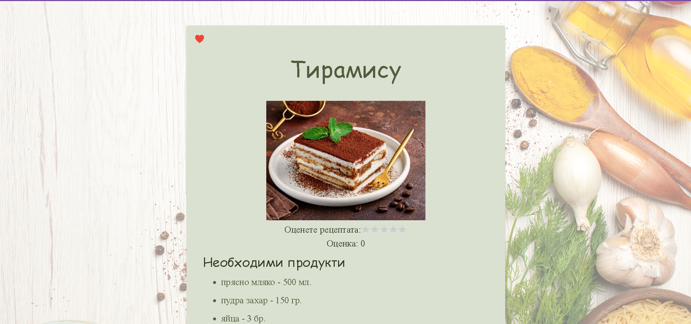

# Cooking Recipes

## 1. Общо описание на проекта

### Уеб приложението "Вкусотийко" представлява виртуална готварска книга, с помощта на която потребителите лесно могат да съхраняват рецептите си на едно място.

### Всяка рецепта в приложението се характеризика с име, продукти, категория, снимка и оценка. Всеки продукт представлява комбинация от име на продукта, количество и мярка на продукта(кг, мл или бр). Категорията може да бъде някоя от следните: Салати, Предястия, Ястия с месо, Ястия без месо и Десерти.

### Приложенито може да се използва едновременно от регистрирани и нерегистрирани потребители. Потребителите се регистрират с имейл, потребителско име и парола. Потребителското име и имейла на всеки потребил са уникални. Регистрираните потребители могат добавят рецепта, да оценяват и коментарат рецепти, имат собсвен списък с любими рецепти и могат да добавят рецепти към него. Обща функционалност за двата вида потребители е търсенето на рецепта по име на рецептата, име на продукт и категория на рецептата.

## 2. Стартиране на проекта

### Необходимо е първо да се стартира *Spring* проекта от *Run* бутона на *InteliJ* (или *Shift+F10*). След това в терминала с командата `cd Front-end` влизаме в папка *Front-end* и отново в терминала стартираме чрез командата `ng serve --open`.

### Следващата стъпка е да добавим примерни данни в базата, за да тестваме приложението. Правим това чрез следните *SQL* скриптове:

 - добавяне на примерен потребител:

```json
{
  "username": "user1",
  "password": "1234",
  "email": "user@mail.com"
}
```

```roomsql
INSERT INTO public.app_user(
    id, email, password, username)
VALUES (1, 'user@mail.com', '$2a$14$mBHIaMm696BpQjaY5TUso.p0UotjoSYd9HEM2GpB086WK2BFTZGHq', 'user1');
```

 - добавяне на рецепта №1

```roomsql
INSERT INTO public.recipe(
    id, category, description, image_path, name, rate, owner)
VALUES (1, 'SALADS', 'Салатата и краствицата се измиват и нарязват. Лукът и магданозът се нарязват на ситно. Овкусява се със сол и зехтин...', 'src/main/resources/savedImages/zelena_salata.jpg','Зелена салата', 0, 1);
```

```roomsql
INSERT INTO public.product_quantity(
recipe_id, measure, product_name, quantity)
VALUES (1, 'COUNT', 'краставица', 1);

INSERT INTO public.product_quantity(
recipe_id, measure, product_name, quantity)
VALUES (1, 'COUNT', 'салата', 1);

INSERT INTO public.product_quantity(
recipe_id, measure, product_name, quantity)
VALUES (1, 'COUNT', 'пресен лук', 2);

INSERT INTO public.product_quantity(
recipe_id, measure, product_name, quantity)
VALUES (1, 'COUNT', 'яйца', 1);
```

 - добавяне на рецепта №2

```roomsql
INSERT INTO public.recipe(
id, category, description, image_path, name, rate, owner)
VALUES (2, 'MEATLESS_DISHES', 'Картофите се белят и се нарязват на колелца. В предварително намазнена тавичка се нареждат нарязаните картофи, докато покрият дъното...', 'src/main/resources/savedImages/ogreten_image.jpg','Огретен', 0, 1);
```

````roomsql
INSERT INTO public.product_quantity(
recipe_id, measure, product_name, quantity)
VALUES (2, 'MILLILITRES', 'готварска сметана', 250);

INSERT INTO public.product_quantity(
recipe_id, measure, product_name, quantity)
VALUES (2, 'MILLILITRES', 'прясно мляко', 250);

INSERT INTO public.product_quantity(
recipe_id, measure, product_name, quantity)
VALUES (2, 'GRAM', 'картофи', 800);

INSERT INTO public.product_quantity(
recipe_id, measure, product_name, quantity)
VALUES (2, 'COUNT', 'яйца', 2);
````

 - добавяне на рецепта №3

```roomsql
INSERT INTO public.recipe(
id, category, description, image_path, name, rate, owner)
VALUES (3, 'DESSERTS', 'В купа се разбиват само жълтъците на яйцата с пудрата захар до пухкав крем. Добавя се маскарпонето и се разбива още около минута...', 'src/main/resources/savedImages/tiramisu_image.jpg','Тирамису', 0, 1);
```

```roomsql
INSERT INTO public.product_quantity(
recipe_id, measure, product_name, quantity)
VALUES (3, 'GRAM', 'маскарпоне', 200);

INSERT INTO public.product_quantity(
recipe_id, measure, product_name, quantity)
VALUES (3, 'COUNT', 'яйца', 2);

INSERT INTO public.product_quantity(
recipe_id, measure, product_name, quantity)
VALUES (3, 'GRAM', 'бишкоти', 500);

INSERT INTO public.product_quantity(
recipe_id, measure, product_name, quantity)
VALUES (3, 'GRAM', 'пудра захар', 150);

INSERT INTO public.product_quantity(
recipe_id, measure, product_name, quantity)
VALUES (3, 'MILLILITRES', 'прясно мляко', 500);
```
### Вече сме готови да тестваме приложението.

## 3. Кратко ръководство за работа с "Вкусотийко"
 
- При стартиране на приложението се зарежда началната страница. 
  - Ако потребителят не е регистриран и не иска да си прави регистрация в системата от тази начална страница може да разгледа всяка рецепта (бутон ***Разгледай*** под снимката на рецептата) и да търси рецепта по име на рецептата, име на продукт и категория. 
  - Ако потребителят иска да се регистрира, това може да стане чрез натискане на бутон ***Регистрация*** от дясната част на панела.
  - Ако потребитлят има регистрация може да влезе в системата като натисне бутона ***Вход*** от дясната част на панела. 


- Регистриране на потребител. При натискане на бутон ***Регисрация*** приложението препраща потребителя на тази страница, където от него се изисква да въведе имейл, потребителско име и парола. Трите полета са задължителни. След натискане на бутон ***Регистрирай се!*** при коретно въведени данни потребителят се препраща на страницата за влизане в систамат.


- Вход в системата. След успешна регистрация или при натискане на бутона ***Вход*** потребителя се препраща към тази страница, където от него се изисква да въведа своите имейл и парола.


- Начална страница за регистрирани потребители. След успешно влизане в система, потребителят се пренсаочва към тази страница.
  - В панела най-отгоре, той може да види потребилското си име, както и да види своите любими рецепти (бутон ***Любими рецепти***) и да добави нова рецепта (бутон ***Добави рецепта***).
  - Ако потребителят иска да излезе от система, това може да стане чрез бутон ***Изход***.
  - Тук регистрираните потребители разполагат отнова с функционалностите да разглеждат рецепти (бутона ***Разгледай*** под снимката на рецептата) и да търсят рецепта по познатите ни критерии.


- Любими рецепти. Това е функционалност, която се поддържа само за регистрираните потребители. Когата потребителят натисне бутона ***Любими рецепти***, той се препраща към тази страница, където вижда списък с всичките си любими рецепти и може да ги разглежда.


- Подробна информация за рецепта. Потребителят се пренасочва към тази страница при натискане на бутон ***Разгледай*** под снимката на някоя рецепта. 
  - Тук той може да види детайлната информация за рецептата, която включва необходими продукти, описание и оценка.
  - Ако потребителят е регистриран, той може да оцени рецептата чрез бутоните звезди, които са разположени под снимката на рецептата. Един потребител може да оцени една рецепта само веднъж.
  - Ако потребителят е регистриран и рецептата му допада, може да я добави към своите любими рецепти чрез бутона сърце, който се намира вдясно над снимката. Един потребител може да добавя една рецепта като любима само веднъж.
  - Ако потребителят е регистриран, може да добави коментар чрез натискане на бутона с плюсчето, който се намира под частта с описанието на рецептата. Един потребител може да коментира дадена рецепта, колкото пъти поиска.




- Добавяне на коментари. След натискане на бутона за добавяне на коментари се отваря нов прозорец, в който потребителя може да добави теста на своя коментар и да го запази. 


- Добавяне на рецепта. Тази функционалност е налична само за регистрирани потребители. След натискане на бутона ***Добави рецепта***, потребителят се пренасочва към тази страница, където след попълване на информацията за нова рецепта и натискане на ***Добави рецепта*** рецептата се добавя към базата данни.


- Изход от системата. След натискане на бутона ***Изход*** потребителят излиза от системата и се пренасочва към началната страница, която е обща и за двата вида потребители (регистрирани и нерегистрирани).

## Структура на базата данни

### Базата данни съдържа общо 6 таблици. 

- recipe
- app_user
- product
- posted_comments - съхранява информацията за всеки добавен коментар, която съдържа потребителят, който е добавил коментара, рецептата, към която е добавен и текста на коментара.
- favourite_recipes - съхранява информация за рецептите, които са добавени като любими, която съдържа рецептата, която е добавена като любима за някой потребител и потребителят, които е добавил конкретната рецепта като любима.
- posted_comments - съхранява информацията за оценените рецепти, която съдържа оценената рецепта, потребителят, който е дал конкретната оценка и оценката 

### Tаблиците ***posted_comments***, ***favourite_recipes*** и ***posted_comments*** са помощни таблици, които изграждат връзките от тип ***ManyToMany*** между двете основни таблици ***recipes*** и ***app_user***. 


